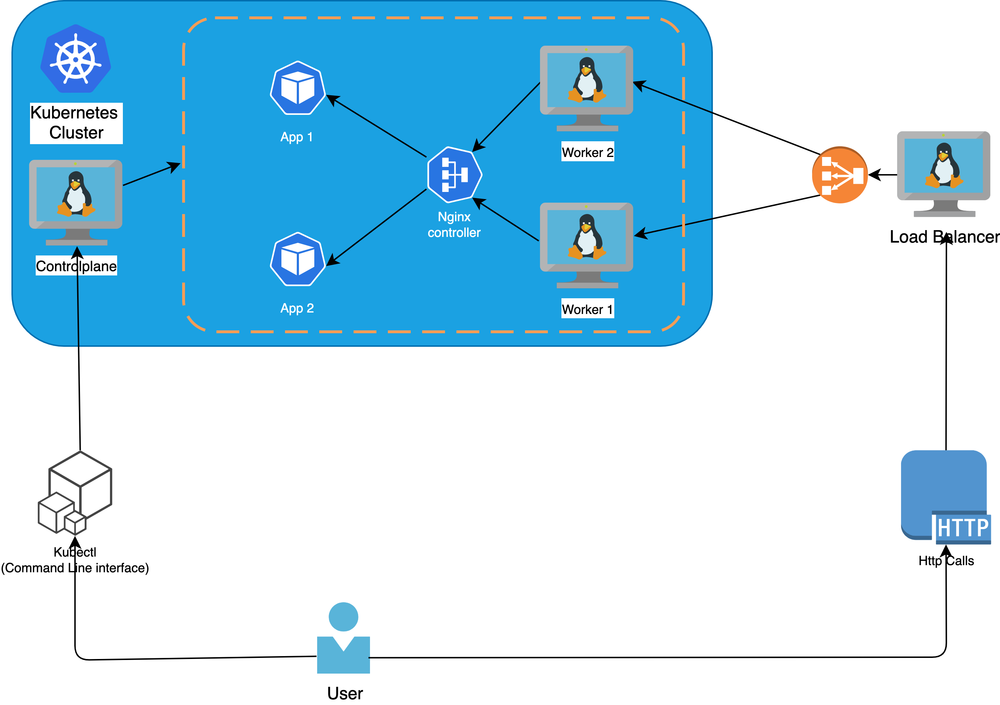

# kube-pyinfra-pulumi-all-in-one


This project aims to show a code pattern example that you cans use as a boilerplate on how you can in one repo handle infrastructure provisioning, configuration management, app deployment and the source code of the application itself

In more details the code present in the repo will allow you to :
1.  Provision an infrastructure on GCP with pulumi (4 linux machines)
2.  Deploy a kubernetes cluster with pyinfra
3.  Expose the cluster to the outside world
4.  Configure kubectl to reach the cluster from your local machine
5.  Deploy a python app into the kubernetes cluster

We will deploy the following architecture :


See the architecture schema below : 


Pre-requisite installs:

* **Just** : Make like alternative written on rust, a bit more flexible, see how to instal it [here](https://just.systems/man/en/chapter_1.html) 
* **Docker** : Container runtime we use for our tutorial + image builder see how to install it [here](https://www.docker.com/get-started/) 
* **Pulumi CLI** : Pulumi will provision our infrastructure in GCP see how to download it [here](https://www.pulumi.com/docs/get-started/install/)
* **Gcloud CLI** : Google cloud cli that authenticate & authorize the interaction with the gcp project, you can download it [here](https://cloud.google.com/sdk/docs/install)
* **Poetry** Poetry is the tool used for managing dependcies and virtual environments for python you can se how to install it [here](https://python-poetry.org/docs/#installation)
## Usage : 

### Preparation steps :
1 - Clone the repo and delete the contents of secrets/iac/* and secrets/k8s/* (your own secrets will be generated)

2 - Init & configure gcloud cli 
```bash
# if gcloud it's not yet associated to your gcp project, init gcloud & select a project where your want to provision your vms with cmd 
gcloud init
# Then after you have initialized gcloud, authorize the lib apis to interact with your GCP project (Pulumi needs this step)
gcloud auth application-default login
```

3 - create a .env at the root dir with following keys and fill values of your own
```bash
# create a .env with theses values and put your own values
GOOGLE_PROJECT=<YOUR_GCP_PROJECT: example -> gifted-cooler-370220>
GOOGLE_REGION=<YOUR_GCP_REGION: example -> europe-west9>
GOOGLE_ZONE=<YOUR_GCP_ZONE: example -> europe-west9-a>
PULUMI_CONFIG_PASSPHRASE=<YOUR_PASS_PHRASE: example -> toto>
KUBECONFIG=${PWD}/secrets/k8s/kubeconfig
DOCKER_IMAGE=<DOCKER_IMG_NAME: example -> my-app>
DOCKER_TAG=0.0.0
DOCKER_USERNAMESPACE=<DOCKER_USER_NAME: example -> senhajirhazi>
```
### Step 1 : Provision compute engines
````bash
# run command
just stack_up 
# this will 
# 1. include .env file as env variables
# 2. create a virutal env and install the app dependencies with poetry
# 3. configure pulumi to store the state file locally at <root>/secrets/iac/
# 4. open a prompt with pulumi asking you if you want to provision the infrastructure of 4 linux machines + network (tap yes if you agree)

# At the end of the provisioning you should have an output similar to this :
(your ips will be differents)
Outputs:
    control-plane-instance_ip: "yy.xxx.173.159"
    load-balancer-instance_ip : "yy.163.165.22"
    network                   : "default-network"
    worker-1-instance_ip      : "yy.xxx.150.176"
    worker-2-instance_ip      : "yy.xxx.230.196"

Resources:
    + 11 created
````
### Step 2 : Install the kubernetes cluster with pyinfra

#### 2.1 Replace the ips in the inventory.py
```python
# in your <root>/deploy/inventory.py replace the ips with the ones you obtained as an output of pulumi provisioning
workers = ["<ip_worker_1>", "<ip_worker_2>"]
controlplanes = ["<ip_controlplane>"]
loadbalancers=["<ip_loadbalancer>"]

```

#### 2.2 Install dependencies on master node and worker nodes

```bash
# run command
just install_kube
# this command will :
# 1. install kubelet, kubeadm on both workers and  kubectl on master
# 2. Initialize the cluster with kubeadm 
# 3. Join the workers to the cluster
```
### Step 3 : Expose k8s to the outside world


```bash
# run command
just expose_k8s
# this command will :
# 1. Deploy the nginx ingress controller inside the cluster 
# 2. Configure the loadbalancer to route trafic to the worker nodes
```

### Step 4 : Configure kubectl to work locally
```yaml
# go to <root>/secrets/k8s/kubeconfig and replace <ip_controlplane> by the one you got from pulumi's provisioning
- cluster:
    certificate-authority-data: 
    server: https://<ip_controlplane>:6443
  name: kubernetes
contexts:
```
```bash
# Then run command
just configure_remote_kubectl
# this command will :
# 1. Regenerate certificate for kubeadm to accept the ip of the controlplane

# Wait few seconds, then you can then test the kubectl command locally 
kubectl get nodes 
>>
NAME            STATUS   ROLES                  AGE   VERSION
control-plane   Ready    control-plane,master   86s   v1.22.4
worker-1        Ready    <none>                 63s   v1.22.4
worker-2        Ready    <none>                 63s   v1.22.4
```

### Step 5 : Deploy python app 

```bash
# run command 
kubectl apply -f k8s/sanic-app -n default
# this command will :
# 1. Deploy the python application of the repo, already built in docker hub (https://hub.docker.com/repository/docker/senhajirhazi/sanic-app/general)

# then test your deployment with 
curl -H "Host:trustme.com" http://<ip_loadbalancer>:80/sanic-app
>>
{"message":"Hello world from Sanic"}%
```

## Video of the project :

You can check [Video](https://www.youtube.com/watch?v=NQJPZhEznj4) for a complete demo and some explanations 